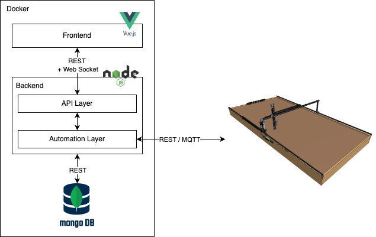

# lettuce

# FarmBot Project: A Project to create a service (Frontend + Backend) for planning and automating tasks

## Description

### FarmBot

The Digital Farming project activities revolve around the FarmBot in our Digital Farming Lab. The FarmBot is a customizable robot mounted on a raised bed that automates various tasks in growing crops. It is controlled by a web app, a Raspberry Pi and a Farmduino (special Arduino), among other things.

### Tasks

During the project, we will cover the entire cycle of plant cultivation and the entire software development cycle. After becoming familiar with the FarmBot, its hardware and software components and interfaces, we will use it to grow plants in our Digital Farming Lab. Tasks include partially assembling the FarmBot, putting it into operation and programming it so that it can perform the required functions.

## Architecture



# Repo Structure

---

```
.
├── README.md                                   <- The top-level README for developers using this project.
├── backend                                     <- Folder containing the backend part of the project.
│   └── src                                     
│       ├── app.js                              <- The entry file. The API server and the endpoints are defined there
│       ├── db                                  
│       │   ├── db.js                           <- File containing all the functions for the CRUD operations with MongoDB
│       │   └── models.js                       <- File where all the models for MongoDB are defined
│       │
│       ├── farmbot                             
│       │   ├── BotController.js                <- The class with all the functions for manipulating the FarmBot
│       │   ├── botUtils.js                     <- File containing all the utilities functions used during the manipulation
│       │   ├── computations.js                 <- File containing functions for mathematical computations
│       │   ├── const.js                        <- File containing a set of constants used all over the backend
│       │   ├── helperDB.js                     <- File with some helper functions for the DB manipulation
│       │   ├── helperStatus.js                 <- File with some helper functions for handling the status logs from the FarmBot
│       │   └── helperToolTip.js                <- File with some helper functions for manipulating the ToolTip on the field
│       │
│       └── scheduling.js                       <- File with some helper functions for handling the scheduling of tasks
│
├── frontend                                    <- Folder containing the frontend part of the project
│   ├── src                                     
│   │   ├── App.vue                             <- Main Vue file
│   │   │
│   │   ├── components                          <- Folder with all the components used for the UI
│   │   │   
│   │   ├── js                                  
│   │   │   ├── api.js                          <- File with some helper functions for communicating with the backend
│   │   │   ├── computing.js                    <- File containing functions for mathematical computations
│   │   │   └── socket.js                       <- File where the handlers for the WebSocket communication are defined
│   │   │   
│   │   ├── main.js                             <- Entry point of the Vuejs Application
│   │   │   
│   │   ├── plugins                             
│   │   │   └── vuetify.js                      <- File where the configuration of Vuetify is done
│   │   │   
│   │   ├── router                              
│   │   │   └── index.js                        <- File where the routes of the frontend App are defined
│   │   │   
│   │   ├── stores                              
│   │   │   └── store.js                        <- The VueX Store where all the global variables are defined
│   │   │   
│   │   ├── style.css                           <- Main CSS file
│   │   │   
│   │   └── views                               
│   │       └── Main.vue                        <- File where the Dashboard is defined
│   │   
│   ├── src-tauri                               <- Directory where the Tauri dependencies are defined
│   ├── tailwind.config.js                      <- File where the configuration of Tailwind is done
│   └── vite.config.js                          <- File where the configuration of Vite is done
```

---

# Dependencies

## Backend (NodeJS)

Take a look at the file `backend/package.json`.

    axios: "^1.4.0",
    cors: "^2.8.5",
    cron: "^2.3.1",
    express: "^4.18.2",
    farmbot: "^15.6.1",
    mongoose: "^7.2.2",
    mqtt: "^4.3.7",
    nanoid: "^3.3.6",
    node-datetime: "^2.1.2",
    nodemon: "^2.0.22",
    socket.io: "^4.6.2"

Or simply run

```
cd backend
npm run install
```

## Frontend (VueJS)

Take a look at the file `backend/package.json`.

    @tauri-apps/api: "^1.4.0",
    animate.css: "^4.1.1",
    axios: "^1.4.0",
    driver.js: "^1.0.5",
    socket.io-client: "^4.6.2",
    vue-toast-notification: "^3.1.1",
    vuetify: "^3.3.2",
    @mdi/font: "^7.2.96",
    @tauri-apps/cli: "^1.4.0",
    cypress: "^12.12.0",
    tailwindcss: "^3.3.2",

Or simply run

```
cd frontend
npm run install
```

# Demo

## Run the Web Version

1. Start Mongo DB

```
brew services start mongodb-community@6.0
```

2. Run the Backend : Open a new terminal

```
cd ./backend
npm run install (Optional if not already)
npm run serve  / npm run dev
```

3. Run the frontend : Open a new terminal

```
cd ./frontend
npm run install (Optional if not already)
npm run dev
```

## Run the Application version

1. Start Mongo DB

```
brew services start mongodb-community@6.0
```

3. Run backend : Open a new terminal

```
cd ./backend
npm run install (Optional if not already)
npm run tauri dev
```

3. Run application : Open a new terminal

```
cd ./frontend
npm run install (Optional if not already)
npm run tauri dev
```

# Build for production

## Build the Web Version

```
cd ./frontend
npm run install (Optional if not already)
npm run build
```

## Build the Application Version

```
cd ./frontend
npm run install (Optional if not already)
npm run tauri build
```

## Run in Docker (With Docker-Compose)
### Build the Docker image
`docker-compose build`

### Run a container based on the image
`docker-compose up`
